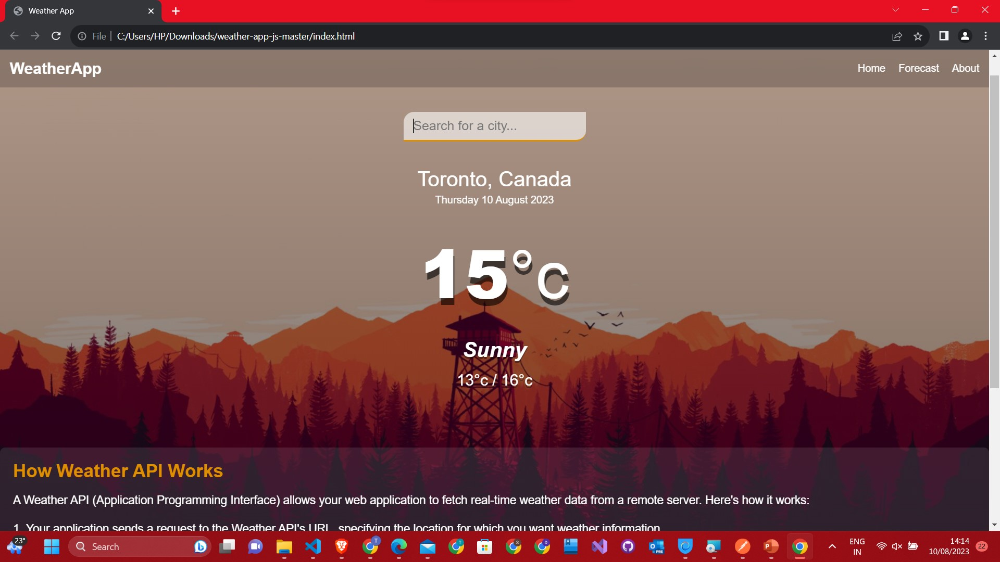
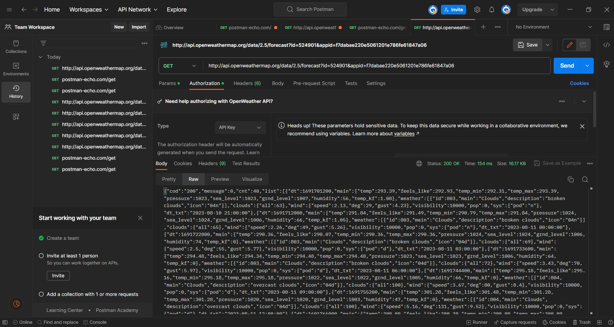
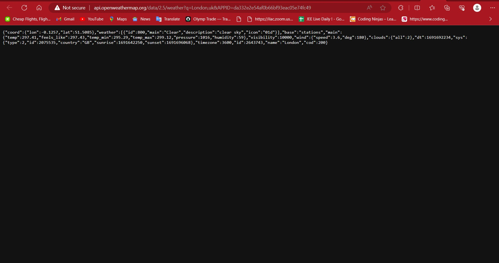

# Assignment 4 Group TS 6 
Group members:
Taranjeet singh
Arishpreet Arishpreet Kaur
Germanjeet Singh Germanjeet Singh
Hasanpreet Singh Hasanpreet Singh
Jashanpreet Kaur Jashanpreet Kaur

### Weather App
❗️Get weather data for any location on the globe immediately with our superb API! Just subscribe with your email and start using minute forecasts, hourly forecasts, history and other weather data in your applications
Make an API call to receive access to the various data:

Current weather
Minute forecast for 1 hour
Hourly forecast for 48 hours
Daily forecast for 8 days
Government weather alerts
Historical weather data for any timestamp for 40+ years historical archive
 
 This API provides with
Weather data in a fast and easy-to-use way
We are providing highly recognisable weather products that make working with the weather data a way easier. We work with millions of developers around a clock and believe that these benefits might be suitable for most of applications, up to the complex enterprise systems.

A spectrum of ready-to-use weather products

Short-term and long-term forecasts, history and observation

Any location on the globe

Transparent pricing and licensing
## Place i got my API Key :


Openweather:https://openweathermap.org/


## IMPORTANT Documentaions:


API documentation https://openweathermap.org/api
Details of your plan https://openweathermap.org/price


```javascript
const APIKey = 'f7dabae220e5061201e786fe61847a06';
```

# Screenshot
Here we have project screenshot :








